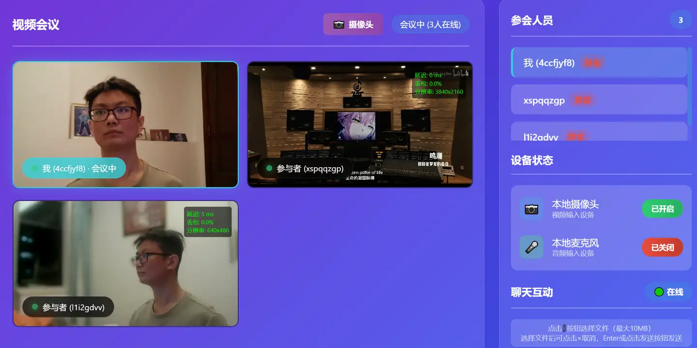
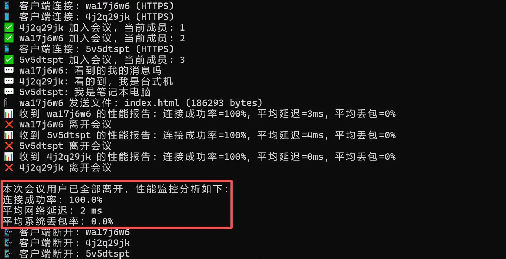

  <a href="README_en.md">English</a>

# WebRTC Mesh 多人视频会议系统
一个基于 WebRTC Mesh 架构的去中心化多人视频会议系统，支持实时音视频通信，实际运行后的前端页面如下：

> *tips：放在首页的是初版 V1.0，后续更新在该仓库下的 release 中，新功能见文末或博客，会不断优化~*

## 项目介绍
这是一个基于 WebRTC 技术 Mesh 架构实现的网页端多人视频会议应用，使用 WebSocket 作为信令服务器，支持同一局域网内或公网跨局域网的网页端多人（上限四个客户端）实时音视频通信。该项目包含完整的前端功能页面和后端信令服务器，开箱即用，适合学习和扩展 WebRTC 相关技术。

## 功能特性
- 🎥 支持多人实时视频会议，采用 Mesh 网络结构，参会者之间建立直接的 P2P 连接
- 🎤 支持音频和视频流传输与状态同步，实时同步客户端摄像头和麦克风开关状态显示
- 🔌 WebSocket 信令服务器管理连接，无需中央服务器转发，视频流在参会者之间传输
- 📱 响应式设计，适配移动端和桌面端，支持现代主流浏览器（Chrome、Edge、Safari）
- 📊 无论是否在会议内，客户端都能看的实时显示并更新的参会人员列表和用户 ID 等信息
- 🎯 简洁直观的用户界面，并将 P2P 项目中的黑色背景更新为渐变蓝紫色，优化整体布局
- 🔄 自动处理 ICE 候选者和 SDP 协商，使用 HTTPS 和 WSS 安全连接，确保会议通信安全

## 技术栈
### 前端
- HTML5/CSS3/JavaScript：用户界面
- WebRTC API：实时音视频通信
- WebSocket：信令传输
- MediaStream API：设备媒体访问

### 后端
- Node.js：服务器运行环境
- Express：Web服务器
- ws：WebSocket服务器
- HTTPS：安全连接通信

## 快速上手
### 环境要求
- Node.js 14.0 或更高版本
- 支持 WebRTC 的现代浏览器
- 摄像头和麦克风（可选）

### 配置步骤
- 在终端安装依赖：npm install express ws https fs
- 生成 SSL 证书：openssl req -nodes -new -x509 -keyout server.key -out server.cert
- 直接启动服务器：node server.js

### 访问页面
- 本地访问：根据终端输出，本地客户端打开浏览器访问 https://localhost:8081
- 局域网内：服务器启动后会显示局域网访问地址，例如 https://192.168.31.93:8081
- 跨局域网：使用内网穿透工具（如 Ngrok、frp）或部署到云服务器，笔者使用 Ngrok
  

> *如图展示的是终端进入项目文件夹下执行 node server.js 后生成的初始日志内容，包含本地访问与局域网访问的链接，跨局域网的公网访问详见笔者博客分享。*

### 基本操作
- 先在提示框内输入服务器地址（本地访问、远端设备、跨局域网的地址均由上给出👆）连接服务器。
- 客户端成功进入该网页后无论有无进入会议都能在“参会人员”区域看到实际进会议的客户端信息。
- 各端无需打开摄像头/麦克风均可直接“加入会议”，并以“阴影覆盖层+📷摄像头关闭”状态显示。
- 点击“设备状态”的麦克风右边红色按钮“已关闭”可变为绿色的“已开启”并打开本地音频流输出，同时各客户端的“参会人员”列表客户端 ID 右边会从“静音”红字变为“开麦”绿字。
- 点击“设备状态”的摄像头右边红色按钮“已关闭”可变为绿色的“已开启”并打开本地视频流输出，同时各客户端的“视频会议”区域看到的该画面输出会从阴影覆盖层变为实时视频流。
- 点击“离开会议”即可退出会议房间，此时依旧能在“参会人员”区域看到实际进会议的客户端信息。

### V2.0 新增聊天互动区域
在“设备状态”区域下方添加一个房间内聊天互动区域，供加入会议后的几个客户端文字互动，预期聊天功能是基于 WebSocket 实现来达到实时通信的目的，且聊天消息是通过信令服务器转发的，而不是通过P2P连接。这是因为文本消息的数据量小，通过服务器转发更简单可靠，不影响P2P视频连接。

> *右下角四个客户端之间聊天互动即新增的文字聊天区域，本地客户端气泡为绿色，其余远端客户端气泡为蓝色，以做区分，同时气泡上方左右边显示用户 ID 与消息发送时间。*

实现上述功能后再新增文件发送功能，通过信令服务器中转文件，可发送 10MB 大小以内的文件传给会议内各客户端接收，其他客户端可以点击收到的的文件消息然后在各自浏览器下载查看。
- 当没有选择文件时：显示文件图标按钮、输入消息文本框、发送按钮（发送文本消息）。
- 当选择文件后：隐藏输入消息文本框，显示文件预览区域（包含文件名和取消按钮）。

现在实现的会议聊天区域功能为：
- 初始状态：下方有文件图标按钮 + "输入消息"文本框 + "发送"按钮三部分。
- 选择文件时：文件图标按钮 + 文件预览区域（含文件名和红色×按钮）+ "发送"按钮。
- 取消文件上传：点击红色×按钮回到初始状态。
- 发送文件：选择文件后点击发送按钮或按 Enter 键发送文件。
- 发送文本：没有选择文件时，在文本框中输入消息后点击发送按钮或按 Enter 键发送文本消息。

### V3.0 新增屏幕共享切换
目前视频区域是只能输出摄像头视频流画面，我们在视频区域右上角再添加一个视频输出切换按钮，它将在摄像头开启后可用。点击后弹出选择菜单，让用户选择输出屏幕画面或摄像头画面。注意屏幕共享时若标签页在播放网页视频或本地视频，此时视频流画面能跟着屏幕捕获输出出来，但是画面对应的音频流是系统音频，而不是麦克风说话输入传来的声音。因此要做一定的音视频轨道管理优化，将音频轨道与视频轨道解耦，让音频能够独立于视频源进行管理和切换：
- 屏幕共享时：优先使用系统音频，如果没有则可用麦克风音频。
- 摄像头模式时：使用麦克风音频（如果麦克风已开启）。
- 麦克风开关时：只控制麦克风音频轨道，不影响屏幕共享音频。
最终实现的 UI 排版效果如下所示：

同时为适配屏幕共享时的画面查看，新增视频双击放大功能，即在视频会议中双击任意参会者的视频画面，将其等比例放大到全屏显示，再次双击或点击关闭按钮或按 Esc 即可以恢复原始大小，从而极大提升会议体验。

### V4.0 新增性能监控面板
通过智能信令调度、精细化 ICE 处理、自适应的重连策略、实时性能监控与保活机制 等一系列优化，显著提升了初次连接的成功率，并使整个 Mesh 网络在复杂网络环境下具备更强的鲁棒性和稳定性。
同时新增性能检测模块，可以在每个加入会议的远端画面右上角查看该 P2P 连接的延迟、丢包、分辨率这三样信息，且鼠标点击一下该性能面板即可完全隐藏透明它，再点一次该区域可以恢复查看性能面板。

全部客户端正常退出会议后，在终端日志末尾会输出会议系统的总连接成功率、平均网络延迟以及平均系统丢包率。
输出格式如下：
- 本次会议用户已全部离开，性能监控分析如下：
- 连接成功率：xx%
- 平均网络延迟：xx ms
- 平均系统丢包率：xx%

# 联系咨询

笔者博客 https://www.zhihu.com/people/13-73-62-89-19

本人邮箱：2022280099@email.szu.edu.cn 

本项目会继续完善更新更多新功能与界面交互，欢迎提 issue 分享修改完善建议！

感谢你的关注与青睐！
