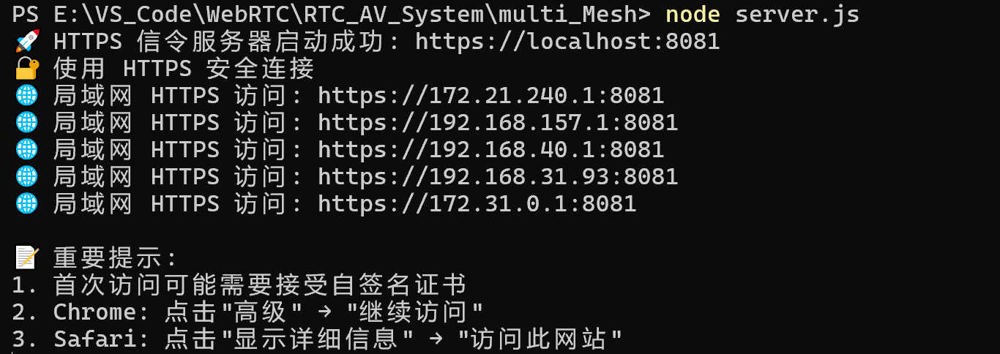
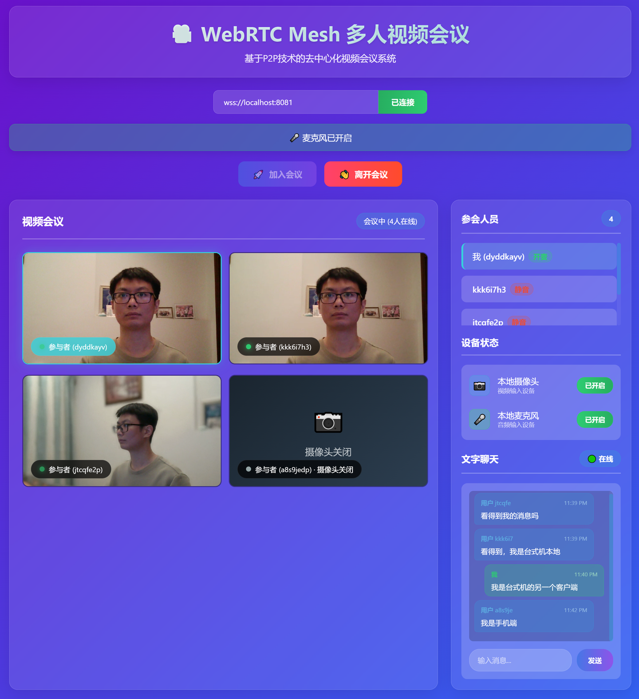
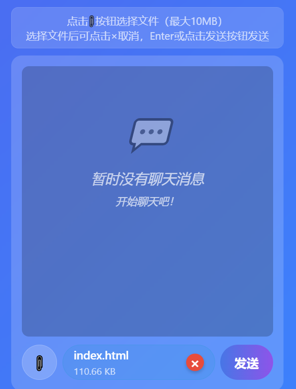
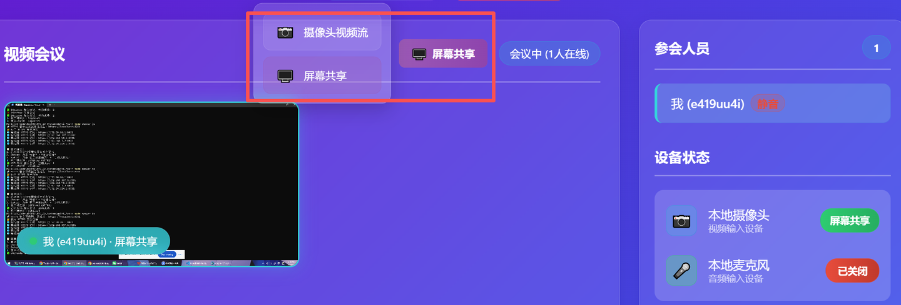
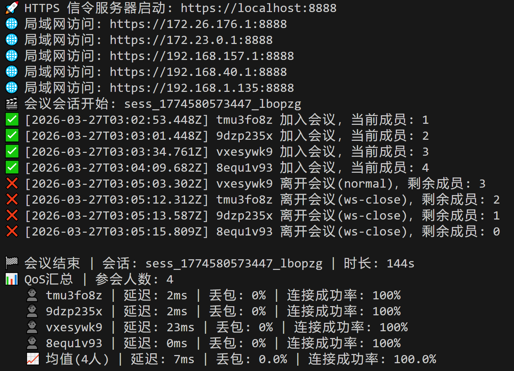

  <a href="README_en.md">English</a>

# WebRTC Mesh 多人视频会议系统

## 项目介绍
这是一个基于 WebRTC 技术 Mesh 架构实现的网页端去中心化多人视频会议应用，使用 WebSocket 作为信令服务器，支持同一局域网内或公网跨局域网的网页端多人（上限四个客户端）实时音视频通信。该项目包含完整的前端功能页面和后端信令服务器，开箱即用，适合学习和扩展 WebRTC 相关技术。实际运行后的前端页面如下：

> *tips：放在首页仓库的是实时更新修改的 latest 最新版本，往期更新版本统一在该仓库下的 release 中，每一版本更新优化的功能见文末或博客，该项目会持续更新不断优化~*

## 功能特性
- 🎥 支持多人实时视频会议，采用 Mesh 网络结构，参会者之间建立直接的 P2P 连接
- 🎤 支持音频和视频流传输与状态同步，实时同步客户端摄像头和麦克风开关状态显示
- 🔌 WebSocket 信令服务器管理连接，无需中央服务器转发，视频流在参会者之间传输
- 📱 响应式设计，适配移动端和桌面端，支持现代主流浏览器（Chrome、Edge、Safari）
- 📊 无论是否在会议内，客户端都能看的实时显示并更新的参会人员列表和用户 ID 等信息
- 🎯 简洁直观的用户界面，并将 P2P 项目中的黑色背景更新为渐变蓝紫色，优化整体布局
- 🔄 自动处理 ICE 候选者和 SDP 协商，使用 HTTPS 和 WSS 安全连接，确保会议通信安全
> *tips：以上描述为最初版本 1.0 功能特性，后续更新见 README 后半部分~*

## 技术栈
### 前端
- HTML5/CSS3/JavaScript：用户界面
- WebRTC API：实时音视频通信
- WebSocket：信令传输
- MediaStream API：设备媒体访问

### 后端
- Node.js：服务器运行环境
- Express：Web服务器
- ws：WebSocket服务器
- HTTPS：安全连接通信

## 快速上手
### 环境要求
- Node.js 14.0 或更高版本
- 支持 WebRTC 的现代浏览器
- 摄像头和麦克风（可选）

### 配置步骤
- 在终端安装依赖：npm install express ws https fs
- 生成 SSL 证书：openssl req -nodes -new -x509 -keyout server.key -out server.cert
- 直接启动服务器：node server.js

### 访问页面
- 本地访问：根据终端输出，本地客户端打开浏览器访问 https://localhost:8081
- 局域网内：服务器启动后会显示局域网访问地址，例如 https://192.168.31.93:8081
- 跨局域网：使用内网穿透工具（如 Ngrok、frp）或部署到云服务器，笔者使用 Ngrok

> *如图展示的是终端进入项目文件夹下执行 node server.js 后生成的初始日志内容，包含本地访问与局域网访问的链接，跨局域网的公网访问详见笔者博客分享。*

### 基本操作
- 先在提示框内输入服务器地址（本地访问、远端设备、跨局域网的地址均由上给出👆）连接服务器。
- 客户端成功进入该网页后无论有无进入会议都能在“参会人员”区域看到实际进会议的客户端信息。
- 各端无需打开摄像头/麦克风均可直接“加入会议”，并以“阴影覆盖层+📷摄像头关闭”状态显示。
- 点击“设备状态”的麦克风右边红色按钮“已关闭”可变为绿色的“已开启”并打开本地音频流输出，同时各客户端的“参会人员”列表客户端 ID 右边会从“静音”红字变为“开麦”绿字。
- 点击“设备状态”的摄像头右边红色按钮“已关闭”可变为绿色的“已开启”并打开本地视频流输出，同时各客户端的“视频会议”区域看到的该画面输出会从阴影覆盖层变为实时视频流。
- 点击“离开会议”即可退出会议房间，此时依旧能在“参会人员”区域看到实际进会议的客户端信息。

### V2.0 新增聊天互动区域
在“设备状态”区域下方添加一个房间内聊天互动区域，供加入会议后的几个客户端文字互动，预期聊天功能是基于 WebSocket 实现来达到实时通信的目的，且聊天消息是通过信令服务器转发的，而不是通过P2P连接。这是因为文本消息的数据量小，通过服务器转发更简单可靠，不影响P2P视频连接。

> *右下角四个客户端之间聊天互动即新增的文字聊天区域，本地客户端气泡为绿色，其余远端客户端气泡为蓝色，以做区分，同时气泡上方左右边显示用户 ID 与消息发送时间。*

实现上述功能后再新增文件发送功能，通过信令服务器中转文件，可发送 10MB 大小以内的文件传给会议内各客户端接收，其他客户端可以点击收到的的文件消息然后在各自浏览器下载查看。
- 当没有选择文件时：显示文件图标按钮、输入消息文本框、发送按钮（发送文本消息）。
- 当选择文件后：隐藏输入消息文本框，显示文件预览区域（包含文件名和取消按钮）。

现在实现的会议聊天区域功能为：
- 初始状态：下方有文件图标按钮 + "输入消息"文本框 + "发送"按钮三部分。
- 选择文件时：文件图标按钮 + 文件预览区域（含文件名和红色×按钮）+ "发送"按钮。
- 取消文件上传：点击红色×按钮回到初始状态。
- 发送文件：选择文件后点击发送按钮或按 Enter 键发送文件。
- 发送文本：没有选择文件时，在文本框中输入消息后点击发送按钮或按 Enter 键发送文本消息。

### V3.0 新增屏幕共享切换
目前视频区域是只能输出摄像头视频流画面，我们在视频区域右上角再添加一个视频输出切换按钮，它将在摄像头开启后可用。点击后弹出选择菜单，让用户选择输出屏幕画面或摄像头画面。注意屏幕共享时若标签页在播放网页视频或本地视频，此时视频流画面能跟着屏幕捕获输出出来，但是画面对应的音频流是系统音频，而不是麦克风说话输入传来的声音。因此要做一定的音视频轨道管理优化，将音频轨道与视频轨道解耦，让音频能够独立于视频源进行管理和切换：
- 屏幕共享时：优先使用系统音频，如果没有则可用麦克风音频。
- 摄像头模式时：使用麦克风音频（如果麦克风已开启）。
- 麦克风开关时：只控制麦克风音频轨道，不影响屏幕共享音频。
最终实现的 UI 排版效果如下所示：

同时为适配屏幕共享时的画面查看，新增视频双击放大功能，即在视频会议中双击任意参会者的视频画面，将其等比例放大到全屏显示，再次双击或点击关闭按钮或按 Esc 即可以恢复原始大小，从而极大提升会议体验。

### V4.0 大量性能与稳定性优化
当前在网络 P2P 连接以及跨局域网通信上时常不稳定，难以做到四个客户端视频画面与信息完全同步，因此需要优化各方面逻辑：
- Offer/Answer 冲突：引入 polite 机制，根据 ID 排序决定谁是“礼貌方”，当双方同时发 offer 时，礼貌方放弃自己的 offer，接受对方的，避免了因信令竞态导致的连接失败，提高了连接成功率，尤其适合多人同时加入的场景。
- 连接超时与重试策略：动态超时时间，根据尝试次数指数退避（最大 10 秒），重试最多 3 次，但重试间隔递增，避免频繁重试对网络造成压力，同时给网络波动更多恢复机会；对连接失败先等待 ICE 状态变化，必要时主动进行 ICE restart，在网络切换时快速重建连接。
- WebSocket 断线重连状态清理：彻底清理所有与旧 ID 相关的 P2P 连接、远程视频容器、成员集合，并清空 pendingCandidates，防止重连后出现“幽灵”视频容器或无效连接，确保重新加入会议时界面和状态完全重置，避免资源泄漏。
- 视频容器与成员列表的自动同步：增加 validateAndSyncState() 函数，每 10 秒检查 DOM 与成员列表是否一致，自动创建缺失容器、移除多余容器，并修复断开的 P2P 连接，即使在网络波动或信令丢失的情况下，也能自动修复界面和连接状态，显著提升系统的健壮性。
- 性能监控（Stats）增强：增加实时码率（kbps），使用更精确的 nominated candidate-pair 计算 RTT，区分视频流有无数据，避免无效统计；码率通过两次 getStats 的字节差计算；提供更全面的网络质量视图，便于调试和用户体验优化。
- 服务器端 QoS 汇总机制优化：新增 scheduleSummary 函数，成员全部离开后延迟 2 秒再输出汇总，使用 pendingSummaryTimer 防止重复输出，确保 sendBeacon 上报有时间到达服务器，避免数据丢失，客户端每 5 秒通过 WebSocket 上报一次性能数据，支持会议结束后的完整质量分析。
- 连接状态变化精细化处理：对 iceConnectionState 的不同状态（connected、failed、disconnected、checking）分别处理；disconnected 状态等待 5 秒让其自动恢复，若未恢复则主动进行 ICE restart；failed 状态触发指数退避重试，避免盲目重连造成资源浪费。
- 重协商防抖优化：为 onnegotiationneeded 事件增加 200ms 防抖延迟，避免在短时间内频繁触发重协商（如同时添加多条轨道时），减少信令风暴风险，提升连接稳定性。
- 信令处理幂等性保障：增加信号去重缓存（5 秒 TTL），防止重复信令被多次处理。
- ICE 候选处理优化：在 remoteDescription 未设置时缓存候选，设置后统一添加，避免时序问题导致候选丢失。
- 本地视频容器自动清理：当 myId 变更时自动移除旧的本地视频容器，防止界面上出现多个本地客户端的视频画面。
- 设备状态同步优化：连接建立成功后主动发送当前设备状态，确保新成员能立即看到已有成员的摄像头/麦克风状态。
- 错误恢复机制：捕获 InvalidStateError 时主动关闭异常连接并延迟重建，避免单次错误导致永久性连接失败。
- 资源清理完整性：离开会议时完整停止并清理所有媒体轨道（screenStream、microphoneAudioTrack 等），避免设备占用和内存泄漏。

> *由于个人电脑系统占用原因，后面将端口改为 8888 更稳定，读者实际使用可根据需求自行调整。*

之后又继续引入 Perfect Negotiation 信令协商机制 + 指数退避重试，解决多人同时加入时的 Offer/Answer 冲突问题，提升连接成功率，然后还优化了音视频质量：
- 音频层优化 Opus 编码（FEC/DTX/码率限制）并设置高优先级传输，弱网环境下保证语音流畅。
- 视频层根据场景（屏幕共享/摄像头）动态调整码率与帧率，避免带宽抢占。

# 联系咨询

笔者博客 https://www.zhihu.com/people/13-73-62-89-19

本人邮箱：2022280099@email.szu.edu.cn 

本项目会继续完善更新更多新功能与界面交互，欢迎提 issue 分享修改完善建议！

感谢你的关注与青睐！
