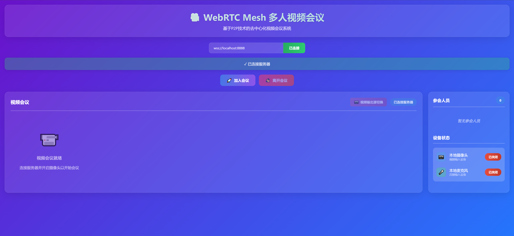
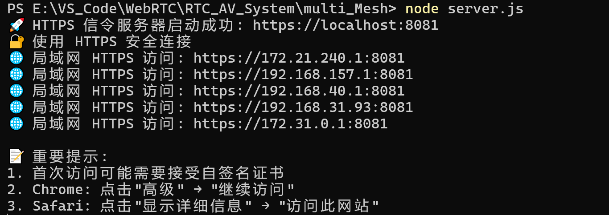
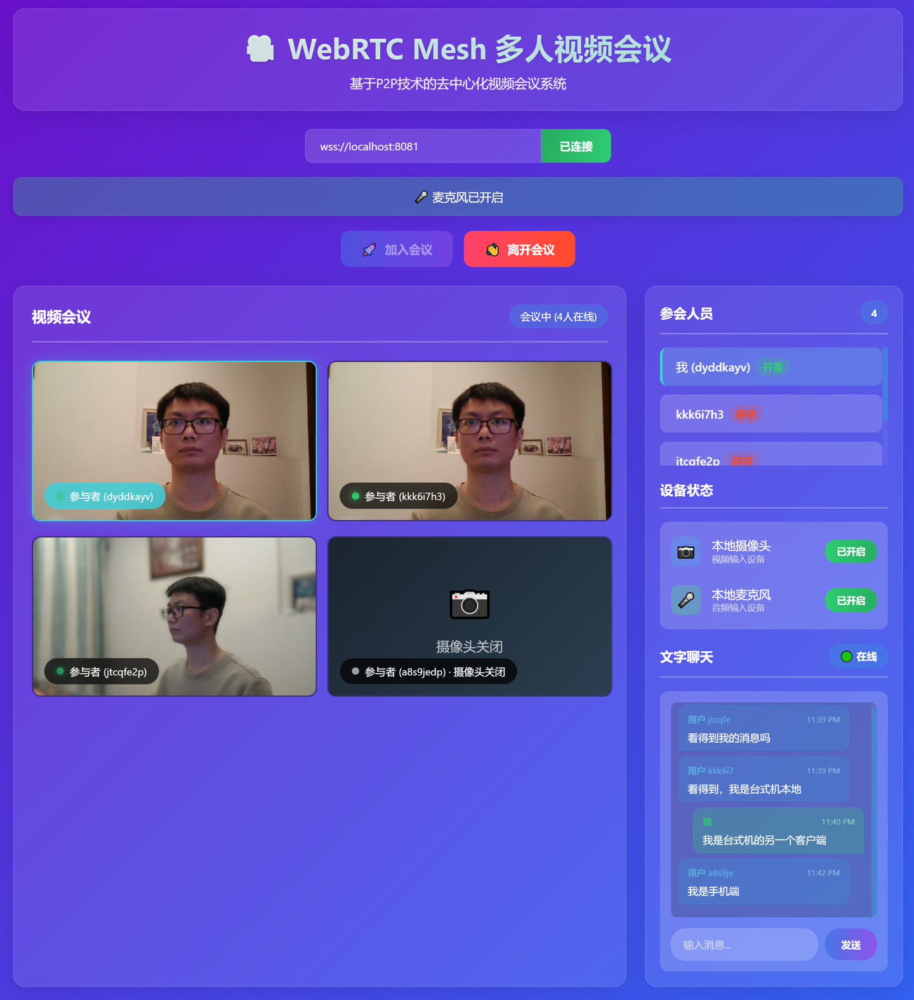
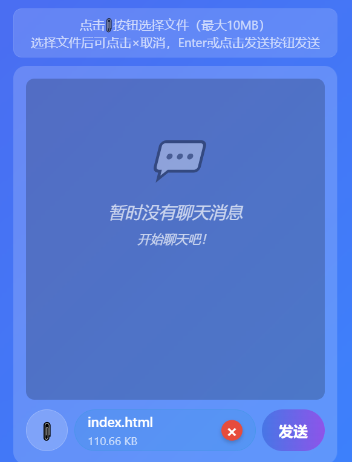
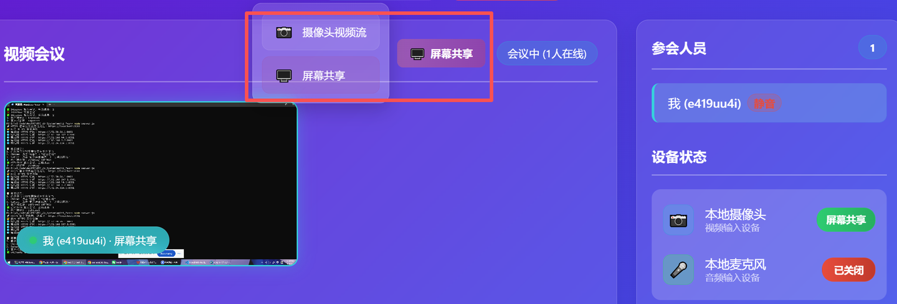

  <a href="README.md">中文</a>

# WebRTC Mesh Multi-Person Video Conferencing System
A decentralized multi-person video conferencing system based on the WebRTC Mesh architecture, supporting real-time audio and video communication. The front-end page after actual operation is as follows:

> *Tips: The initial version V1.0 is displayed on the homepage, subsequent updates are in the release under this repository, and new features can be found at the end of the document or on the blog, which will be continuously optimized~*

## Project Introduction
This is a web-based multi-person video conferencing application implemented based on WebRTC technology and Mesh architecture, using WebSocket as the signaling server. It supports real-time audio and video communication among multiple clients (up to four clients) on the same local area network (LAN) or across LANs over the public network. The project includes complete front-end functional pages and a back-end signaling server, ready to use out of the box, suitable for learning and expanding WebRTC-related technologies.

## Functional Features
- 🎥 Supports multi-person real-time video conferencing with a Mesh network structure, where participants establish direct P2P connections
- 🎤 Supports audio and video stream transmission and status synchronization, and real-time synchronization of client camera and microphone on/off status display
- 🔌 WebSocket signaling server manages connections, no central server forwarding required, video streams are transmitted between participants
- 📱 Responsive design, adapted to mobile and desktop terminals, supporting modern mainstream browsers (Chrome, Edge, Safari)
- 📊 Whether in the conference or not, clients can view the real-time displayed and updated list of participants and user IDs
- 🎯 A concise and intuitive user interface, updated the black background in the P2P project to a gradient blue-purple color, and optimized the overall layout
- 🔄 Automatically handles ICE candidates and SDP negotiation, uses HTTPS and WSS secure connections to ensure secure conference communication

## Technology Stack
### Frontend
- HTML5/CSS3/JavaScript: User interface
- WebRTC API: Real-time audio and video communication
- WebSocket: Signaling transmission
- MediaStream API: Device media access

### Backend
- Node.js: Server runtime environment
- Express: Web server
- ws: WebSocket server
- HTTPS: Secure connection communication

## Quick Start
### Environment Requirements
- Node.js 14.0 or higher
- Modern browsers that support WebRTC
- Camera and microphone (optional)

### Configuration Steps
- Install dependencies in the terminal: npm install express ws https fs
- Generate SSL certificate: openssl req -nodes -new -x509 -keyout server.key -out server.cert
- Start the server directly: node server.js

### Access the Page
- Local access: According to the terminal output, open the browser on the local client and visit https://localhost:8081
- Within LAN: After the server starts, it will display the LAN access address, such as https://192.168.31.93:8081
- Across LANs: Use intranet penetration tools (such as Ngrok, frp) or deploy to a cloud server, the author uses Ngrok

> *The figure shows the initial log content generated after executing node server.js in the project folder in the terminal, including links for local access and LAN access. For public network access across LANs, please refer to the author's blog sharing.*

### Basic Operations
- First, enter the server address in the prompt box (local access, remote device, and cross-LAN addresses are given above👆) to connect to the server.
- After the client successfully enters the webpage, it can see the client information of the actual conference participants in the "Participants" area regardless of whether it has entered the conference.
- All clients can directly "Join Conference" without turning on the camera/microphone, and will be displayed with a "shadow overlay + 📷 Camera Off" status.
- Click the red "Closed" button next to the microphone in the "Device Status" to change it to the green "Opened" and turn on the local audio stream output. At the same time, the text next to the client ID in the "Participants" list of each client will change from red "Muted" to green "Unmuted".
- Click the red "Closed" button next to the camera in the "Device Status" to change it to the green "Opened" and turn on the local video stream output. At the same time, the picture output seen by each client in the "Video Conference" area will change from the shadow overlay to the real-time video stream.
- Click "Leave Conference" to exit the conference room, and you can still see the client information of the actual conference participants in the "Participants" area.

### V2.0 New Chat Interaction Area
Add an in-room chat interaction area below the "Device Status" area for text interaction among several clients after joining the conference. The expected chat function is implemented based on WebSocket to achieve real-time communication, and chat messages are forwarded through the signaling server instead of P2P connections. This is because text messages have a small data volume, and forwarding through the server is simpler and more reliable without affecting the P2P video connection.

> *The chat interaction between the four clients in the lower right corner is the newly added text chat area. The local client bubbles are green, and the other remote client bubbles are blue for distinction. At the same time, the user ID and message sending time are displayed on the left and right above the bubbles.*

After implementing the above functions, add the file sending function, transfer files through the signaling server, and send files up to 10MB to each client in the conference for reception. Other clients can click the received file message and download it in their respective browsers for viewing.
- When no file is selected: Display the file icon button, input message text box, and send button (send text messages).
- When a file is selected: Hide the input message text box and display the file preview area (including the file name and cancel button).

The currently implemented conference chat area functions are:
- Initial state: Three parts at the bottom - file icon button + "Input Message" text box + "Send" button.
- When selecting a file: File icon button + file preview area (with file name and red × button) + "Send" button.
- Cancel file upload: Click the red × button to return to the initial state.
- Send file: After selecting a file, click the send button or press the Enter key to send the file.
- Send text: When no file is selected, enter the message in the text box and click the send button or press the Enter key to send the text message.

### V3.0 New Screen Sharing Switch
Currently, the video area can only output the camera video stream picture. We add a video output switch button in the upper right corner of the video area, which will be available after the camera is turned on. Clicking it pops up a selection menu, allowing users to choose to output the screen picture or the camera picture. Note that when sharing the screen, if the tab page is playing web video or local video, the video stream picture can be output along with the screen capture, but the corresponding audio stream of the picture is the system audio, not the sound input from the microphone. Therefore, certain audio and video track management optimizations need to be made to decouple the audio track from the video track, allowing the audio to be managed and switched independently of the video source:
- When screen sharing: Prioritize using system audio, if not available, microphone audio can be used.
- In camera mode: Use microphone audio (if the microphone is turned on).
- When the microphone is switched on/off: Only control the microphone audio track, without affecting the screen sharing audio.
The final implemented UI layout effect is as follows:

At the same time, to adapt to viewing the picture during screen sharing, a video double-click zoom function is added. That is, double-click any participant's video picture in the video conference to zoom it to full screen proportionally, and double-click again, click the close button, or press Esc to restore the original size, thereby greatly improving the conference experience.

# Contact & Consultation

Author's Blog https://www.zhihu.com/people/13-73-62-89-19

Author's Email: 2022280099@email.szu.edu.cn 

This project will continue to be improved and updated with more new functions and interface interactions. Welcome to raise issues to share suggestions for modification and improvement!

Thank you for your attention and support!

